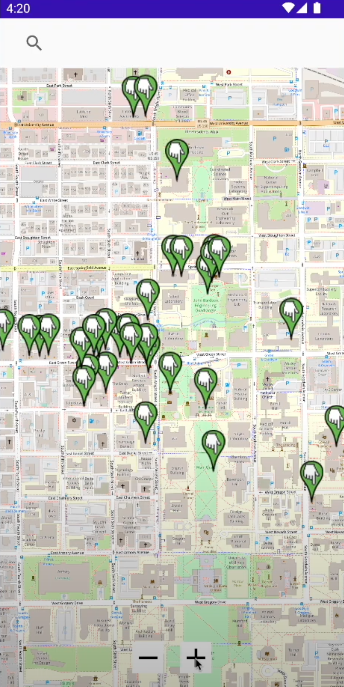
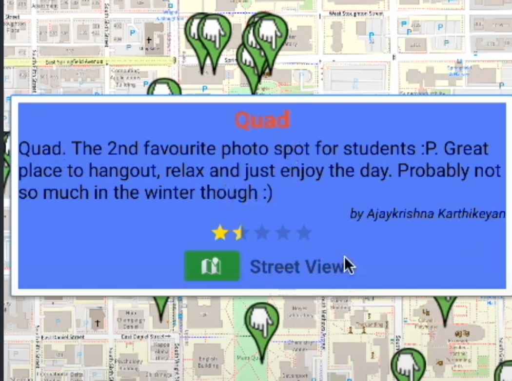
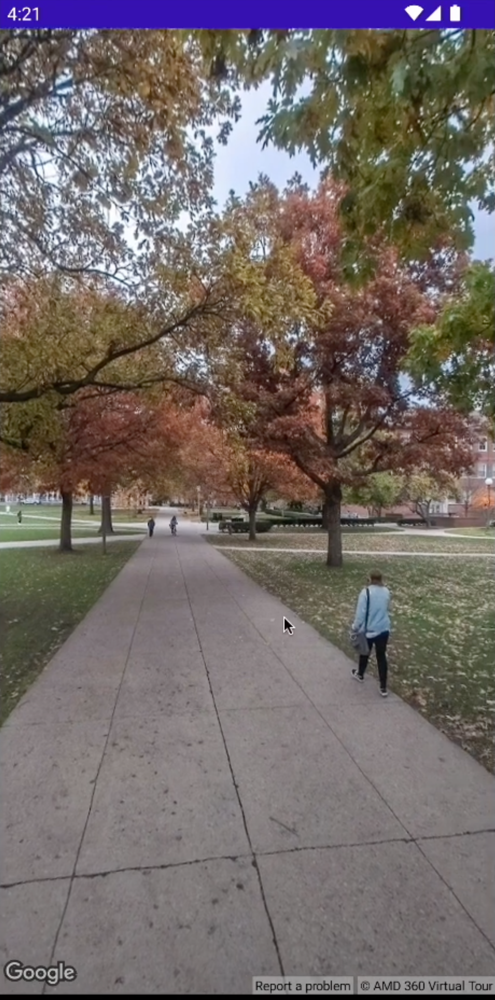

# CS 124 2022–2023 Machine Project

## Main Features

- Markers for Points of Interest (POIs) on Campus
- Search for POIs
- New revamp custom info window for markers
  - Custom layout (better looking)
  - More information (Name, description, username that submitted)
  - Button to toggle google map street view
- Google map street view layout
  - Open up a new activity with custom layout and the street view of the selected place
  - User can pan/move the camera freely
  - Return button
- Add a field in add place layout for user to enter the name of the place
- Star based rating system for POIs

## Technologies Used
- Android Studio
- Google Maps API
- Google Places API
- Google Street View API
  
- Java
- XML

## Showcase

|  |  |  |
|------------------------|------------------------|--------------------------------------|
| Map                    | POI                    | Street View                          |

https://youtu.be/iclOn7wiQdE